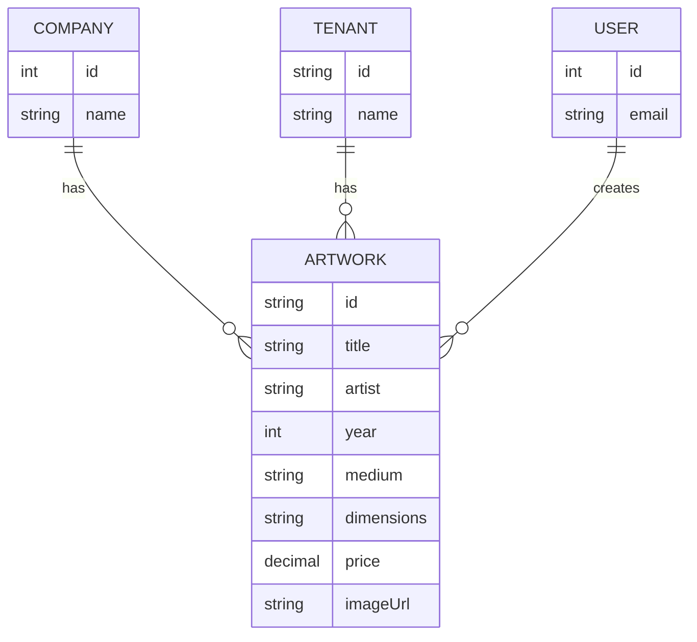

# Art Inventory Module Design Document

## Summary

This document outlines the design for a new "Art Inventory" module. This feature will allow users to manage a collection of artworks, where each artwork is associated with a specific company and tenant within the existing multi-tenant architecture.

## Context

The application currently supports multi-tenancy, with `Company` and `Tenant` entities forming the basis of data separation and organization. Users are associated with these entities. The goal is to introduce a new resource, `Artwork`, which can be managed by users within their company and tenant context. This requires creating a new module that integrates seamlessly with the existing data model and application structure.

## Detailed Design

The implementation will be centered around a new `artworks` module, following the project's established conventions.

### 1. Database Schema

A new table named `artwork` will be created in the relational database. The `ArtworkEntity` will be defined as follows, using TypeORM:

```typescript
// src/artworks/infrastructure/persistence/relational/entities/artwork.entity.ts

import {
  Column,
  CreateDateColumn,
  Entity,
  ManyToOne,
  PrimaryGeneratedColumn,
  UpdateDateColumn,
} from 'typeorm';
import { EntityRelationalHelper } from '../../../../../utils/relational-entity-helper';
import { CompanyEntity } from '../../../../../companies/infrastructure/persistence/relational/entities/company.entity';
import { TenantEntity } from '../../../../../tenants/infrastructure/persistence/relational/entities/tenant.entity';
import { UserEntity } from '../../../../../users/infrastructure/persistence/relational/entities/user.entity';

@Entity({ name: 'artwork' })
export class ArtworkEntity extends EntityRelationalHelper {
  @PrimaryGeneratedColumn('uuid')
  id: string;

  @Column({ type: String })
  title: string;

  @Column({ type: String, nullable: true })
  artist: string;

  @Column({ type: 'int', nullable: true })
  year: number;

  @Column({ type: String, nullable: true })
  medium: string;

  @Column({ type: String, nullable: true })
  dimensions: string;

  @Column({ type: 'decimal', precision: 10, scale: 2, nullable: true })
  price: number;

  @Column({ type: String, nullable: true })
  imageUrl: string;

  @ManyToOne(() => CompanyEntity)
  company: CompanyEntity;

  @ManyToOne(() => TenantEntity)
  tenant: TenantEntity;

  @ManyToOne(() => UserEntity)
  createdBy: UserEntity;

  @CreateDateColumn()
  createdAt: Date;

  @UpdateDateColumn()
  updatedAt: Date;
}
```

**Relationships:**

*   **`ManyToOne` with `CompanyEntity`**: Each artwork belongs to a single company.
*   **`ManyToOne` with `TenantEntity`**: Each artwork is scoped to a single tenant.
*   **`ManyToOne` with `UserEntity`**: Each artwork will have a reference to the user who created it.

### 2. Module Structure

A new `src/artworks` directory will be created with the standard module structure:

```
src/
└── artworks/
    ├── artworks.controller.ts
    ├── artworks.module.ts
    ├── artworks.service.ts
    ├── domain/
    │   └── artwork.ts
    ├── dto/
    │   ├── create-artwork.dto.ts
    │   └── update-artwork.dto.ts
    └── infrastructure/
        └── persistence/
            └── relational/
                ├── entities/
                │   └── artwork.entity.ts
                └── repositories/
                    └── artwork.repository.ts
```

*   **`artworks.controller.ts`**: Will expose RESTful endpoints for CRUD operations (e.g., `POST /artworks`, `GET /artworks`, `GET /artworks/:id`, `PATCH /artworks/:id`, `DELETE /artworks/:id`).
*   **`artworks.service.ts`**: Will contain the business logic for creating, retrieving, updating, and deleting artworks.
*   **`artworks.module.ts`**: Will define the module, import `TypeOrmModule.forFeature([ArtworkEntity])`, and declare the controller and service.
*   **DTOs**: `CreateArtworkDto` and `UpdateArtworkDto` will be used for data validation and transfer.

### 3. API Endpoints

The `ArtworksController` will handle requests, which will be protected by the existing authentication and authorization guards.

*   `POST /artworks` - Create a new artwork.
*   `GET /artworks` - Retrieve a paginated list of artworks (scoped to the user's tenant/company).
*   `GET /artworks/:id` - Retrieve a single artwork by its ID.
*   `PATCH /artworks/:id` - Update an artwork.
*   `DELETE /artworks/:id` - Delete an artwork.

## Proposed Solution

The proposed solution involves creating a self-contained `artworks` module that mirrors the structure of existing modules like `companies` and `tenants`. By using TypeORM and following the established entity design, the new feature will integrate cleanly into the existing application. The business logic in `ArtworksService` will be responsible for handling the relationships between artworks, companies, tenants, and users, ensuring data integrity and proper scoping.

A high-level diagram of the new entity and its relationships:



## Future Considerations

*   **File Uploads**: The `imageUrl` is currently a string. The existing `files` module could be integrated to handle image uploads for artworks.
*   **Access Control**: More granular role-based access control (e.g., who can edit or delete artworks) can be implemented using the existing `roles` guard system.
*   **Search and Filter**: Advanced searching and filtering capabilities can be added to the `GET /artworks` endpoint.
*   **Auditing**: A more robust auditing mechanism could be implemented to track changes to artwork records over time.

This design provides a solid foundation for the Art Inventory feature while adhering to the existing architectural principles of the application. The next step is to get approval for this design before proceeding to implementation planning.
